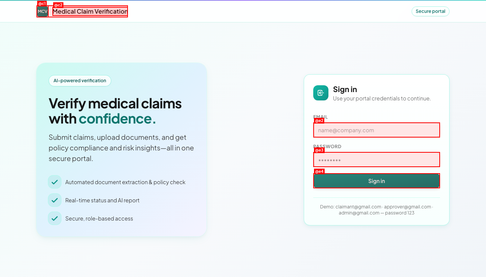
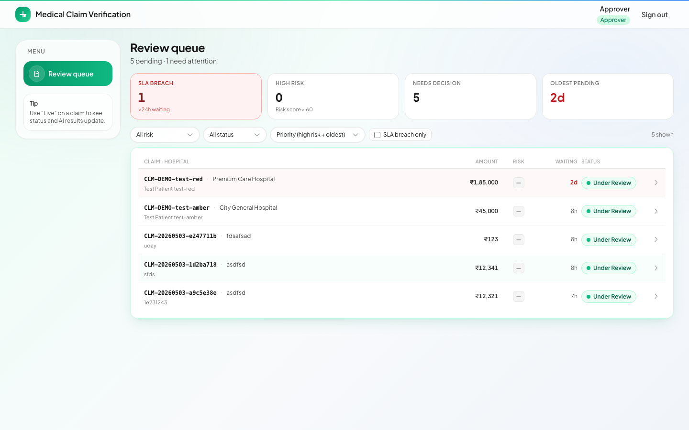
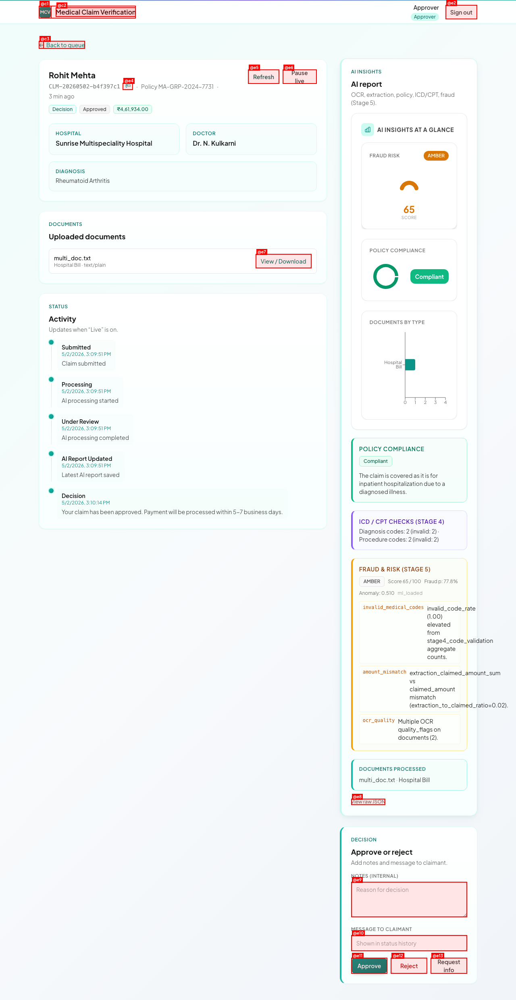
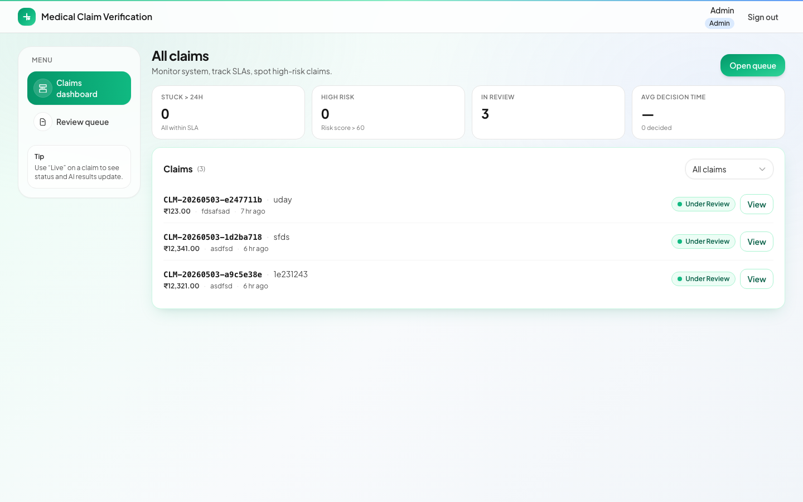
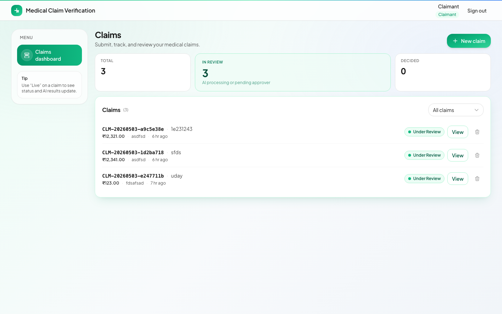
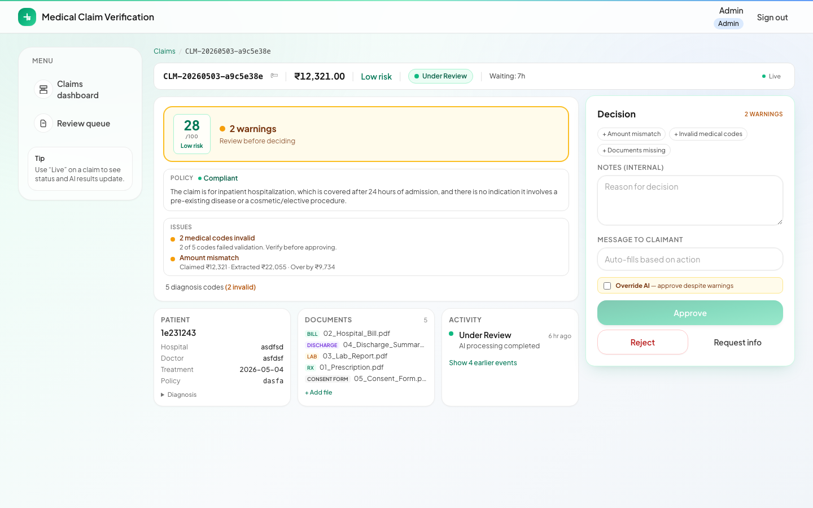
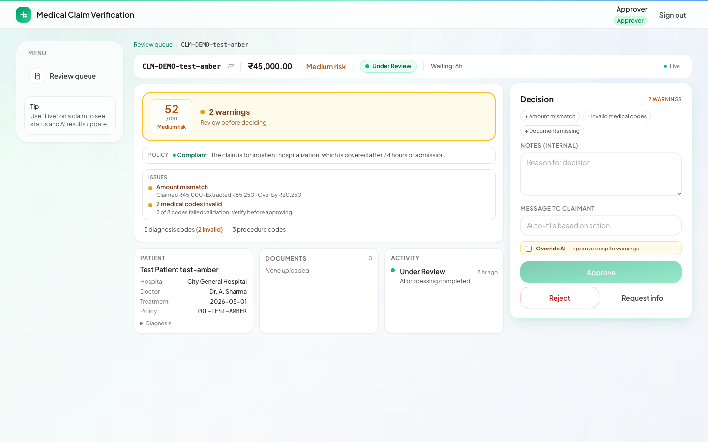
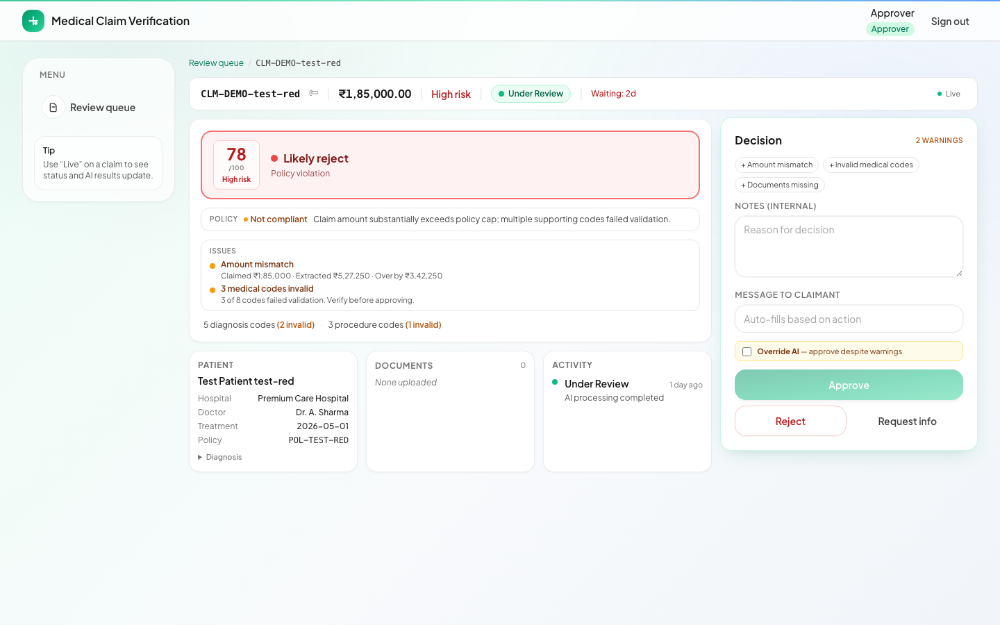

# Medical Claim Verification — Project Defense

> **One line to remember:** This is a decision-support system for medical claims. It assists humans, it does not replace them.

---

## 1. The problem

Medical claim processing today is **slow, manual, and error-prone**.

- Approvers spend most of their time reading PDFs and copying numbers between systems.
- Mistakes cost money two ways: paying out fraudulent claims, and rejecting legitimate ones.
- Volume keeps growing. Manual review does not scale.

We built this to help approvers make better decisions, faster — without taking the decision away from them.

---

## 2. System thinking

The pipeline is a single, linear flow:

```
Claim + documents
      │
      ▼
  OCR / text extraction       (PyMuPDF, vision fallback)
      │
      ▼
  Field extraction             (LLM — Groq / Gemini)
      │
      ▼
  Policy compliance check      (RAG over policy .txt + LLM reasoning)
      │
      ▼
  ICD / CPT format validation  (regex)
      │
      ▼
  Risk scoring                 (rules always, ML if trained artifacts exist)
      │
      ▼
  Decision support output:
    Verdict suggestion + risk score + issues + supporting docs
      │
      ▼
  Human approver decides       (Approve / Reject / Request more info)
```

The output is **never** a final decision. It is structured input the approver uses to decide.

---

## 3. Roles — different UX for different jobs

| Role | Job | UX optimized for |
|------|-----|------------------|
| **Claimant** | Submit claim, upload docs, track status | Form simplicity, status clarity, "what should I do next" |
| **Approver** | Review queue, decide each claim | Scan-ability (risk + warnings + docs), decision speed, sticky decision panel |
| **Admin** | Monitor system, spot SLA breaches and high-risk claims | Alert-driven stats, oldest-first sort, ownership view (deferred) |

The same data backs all three views. The interface for each is shaped by the job they do.

---

## 4. Decision flow — walk through one claim

1. **Claimant submits** patient name, policy number, hospital, doctor, diagnosis, treatment date, claimed amount, and uploads supporting documents (hospital bill, prescription, lab report, discharge summary).
2. **Backend creates** the claim and queues background AI processing.
3. **Pipeline runs** through 5 stages. Each stage writes to `ai_report_json`.
4. **Issues surface** in human-readable form:
   - "2 medical codes invalid" (when ICD/CPT format check fails)
   - "Amount mismatch — Claimed ₹12,321 · Extracted ₹22,000 · Over by ₹9,679" (when document amount doesn't match claim)
5. **Risk score** is computed (0–100) with a band label (Low / Medium / High).
6. **Approver opens the claim**. The detail page shows in priority order:
   1. Verdict banner ("Likely approve" / "Needs review" / "Likely reject")
   2. Risk score + compliance verdict
   3. Top 2 issues with severity
   4. Supporting documents (sorted by importance)
   5. Patient details (collapsed by default)
7. **Approver decides** — Approve / Reject / Request info. If warnings exist, the Approve button is disabled until they tick the "Override AI" checkbox. The message to claimant auto-fills based on the action.

---

## 5. What is "intelligent" — and what is not

We are deliberate about this. We do not call this an "AI project."

**What is intelligent:**
- **Document understanding** — OCR (PyMuPDF + vision fallback) plus LLM-driven structured extraction maps free-text PDFs to claim fields.
- **Policy reasoning** — RAG over policy `.txt` documents retrieves relevant rules. An LLM produces a compliance verdict + cited explanation.
- **Risk scoring** — Rule-based heuristics always run (anomaly checks, amount-mismatch ratios, invalid code rates). If trained ML artifacts exist on disk (`backend/ml_models/artifacts/`), an IsolationForest + XGBoost ensemble adds to the score.

**What is honest:**
- ML inference is **optional**. The system is **rule-based today**, ML-extendable tomorrow.
- No external medical-knowledge API. The policy "RAG" works against the policy `.txt` files we ship.
- We do not claim production accuracy.

---

## 6. Tradeoffs we made (this is the part that matters)

| Tradeoff | Choice | Why |
|----------|--------|-----|
| **Accuracy vs Speed** | Accuracy. Pipeline takes 30–90 seconds per claim. | Wrong decisions cost more than slow decisions in healthcare. |
| **Automation vs Human control** | Human-in-the-loop, always. | A wrong rejection hurts a real patient. We surface signals; the human decides. |
| **False positives vs Fraud detection** | Lean toward false positives (more flags). | Approver can dismiss a flag in 5 seconds. Missing actual fraud costs the insurer thousands. |
| **Background thread vs proper queue** | Daemon thread + on-startup orphan resume. | Demo-grade. Production would use Celery/RQ. We documented this and built the resume mechanism so a backend restart doesn't strand claims. |
| **Charts vs density** | Removed charts. | Charts were eye-candy. Approvers needed scannable text. Removing them dropped bundle size 60% and made the page faster. |

---

## 7. Real problems we solved

- **Noisy OCR** — PDFs with mixed text/image pages. Solution: PyMuPDF native extraction first, vision OCR fallback when text density is too low.
- **Document → claim field mapping** — Each document type (Bill, Prescription, Lab Report, Discharge Summary) has a tailored extraction prompt. Output is normalized to the same field schema.
- **Detecting amount mismatches** — Sum extracted line-item amounts from bills, compare against the claimant's stated amount. Flag if ratio is off, surface the actual numbers (Claimed / Extracted / Diff).
- **Reviewer workflow** — Verdict-first layout. Risk and warnings visible in 3 seconds. Sticky decision panel with override guardrails. Quick reason chips that append to notes.
- **Operational reliability** — `BrokenPipeError` from background prints used to mark claims as failed. Fixed with a safe-print shadow. Backend restarts used to leave claims stuck in `Processing` forever. Fixed with `_resume_orphaned_pipelines()` on startup.

---

## 8. Limitations (we don't hide these)

- **OCR errors propagate.** Garbage text → garbage extraction. We mitigate with quality flags and human review, but cannot guarantee clean data from low-quality scans.
- **No real ML training data.** The synthetic dataset generator (`backend/ml_models/data_generator.py`) produces toy data. Real-world fraud patterns would need real claim histories.
- **Rule-based system is not adaptive.** New fraud patterns require a code change, not a model retrain.
- **No external integration.** Not connected to any insurance/hospital/payer APIs. The "policy database" is a folder of `.txt` files we wrote.
- **No assignment / ownership model.** Admin can see queue health but cannot reassign claims to specific approvers.
- **No audit log UI.** Status history is in the database but not surfaced for compliance review.
- **Single-tenant.** No multi-org separation.

---

## 9. Future scope

| Area | Next step |
|------|-----------|
| **ML** | Train a real fraud-detection model on labeled historical claims. The Stage 5 plumbing already supports it. |
| **NLP** | Better medical entity recognition (drug names, procedures, dosages) so extraction handles edge cases that LLMs miss. |
| **Integration** | Hospital information system (HIS) connectors for direct claim ingestion. Insurer policy APIs for live rule checks. |
| **Auto-decision** | For very low-risk, fully compliant claims (risk < 10, no warnings, all required docs present), auto-approve and queue for spot-check audit instead of approver review. |
| **Workflow** | Assignment model (assign claim to specific approver), bulk actions, escalation rules, SLA configuration per insurer. |
| **Production** | Celery/RQ for the background pipeline, S3 for documents, real auth (OAuth/SSO), audit log surface, multi-tenant data partitioning. |

---

## 10. Demo strategy (3–4 minutes)

**Do not click randomly. Stick to this script.**

1. **Login as approver.** Land on `/approver`. Point to the alert-driven stats: "SLA breach, High risk, Needs decision, Oldest pending. The page tells you which claim to pick first." (15 seconds)
2. **Click the top row** (highest priority). Detail page opens. (5 seconds)
3. **Point to the verdict banner.** "Risk 28, Low risk, 2 warnings to check. The whole page is sized so I don't scroll." (30 seconds)
4. **Read the two issues out loud.** "Amount mismatch — claimed 12,321, extracted 22,000, over by 9,679. Two medical codes invalid." Show the policy compliance line. (30 seconds)
5. **Show the documents grid.** "Bill, Discharge, Lab, Prescription — sorted by importance. One click to open." (15 seconds)
6. **Make the decision.** Click "Reject" because of the amount mismatch. Show the auto-filled message to claimant. Confirm. (30 seconds)
7. **Back to queue.** Show the row updated, count changed. (15 seconds)
8. **Switch role** (sign out → admin). Show the admin dashboard with stats colored by urgency. (30 seconds)

**Total: ~3 minutes. Skip the claimant view unless asked.**

---

## 11. Expected questions — prepared answers

| Question | Answer |
|----------|--------|
| Why not fully automate the decision? | Wrong rejections cause real patient harm. The cost of human review per claim is much lower than the cost of one wrong decision. We chose human-in-loop deliberately. |
| How is the risk score calculated? | Rule-based signals: invalid medical code rate, amount-mismatch ratio between extracted and claimed, anomaly detection on numeric fields. If trained ML artifacts are present, an IsolationForest + XGBoost ensemble contributes to the final score. Each signal is explainable — the approver sees why. |
| How will it scale? | Today the AI pipeline runs in a daemon thread per claim. Production would move it to Celery/RQ with worker pools. The `_resume_orphaned_pipelines()` startup hook already handles the restart-recovery case. |
| What if OCR fails? | Two fallbacks. First, PyMuPDF native text extraction. If a page has too little text, we render it to an image and run vision OCR. If both fail, the document is flagged with a quality warning and the approver is told to check it manually. |
| Why session cookies and not JWT? | Simplicity for the demo, and session cookies work well with `withCredentials` for browser-only frontends. Production would consider JWT/OAuth for service-to-service or mobile apps. |
| Why SQLite? | Zero setup. Postgres is supported via Docker Compose if you need it — just change `DATABASE_URL`. |
| Why Groq specifically? | Cheap, fast, OpenAI-compatible API. Gemini is also wired in as a fallback. The pipeline is provider-agnostic — swap in another provider by setting the env var. |

---

## 12. What to avoid in the presentation

- Don't say "AI project" loosely. Say "decision-support system with rule-based + LLM-driven extraction."
- Don't over-explain the UI. The UI exists to make the decision-support data scannable. The thinking is in the pipeline and the role-aware design.
- Don't read slides. Tell the story.
- Don't show every screen. Three screens (queue → detail → decision) is the entire story.
- Don't claim it's production-ready. Call out the limitations in section 8 before they ask.
- Don't talk about CSS. Nobody wants to hear about Tailwind classes.

---

## 13. Closing line

> **The system reduces manual effort and highlights risky claims, but keeps human control for the final decision.**

---

## Appendix — Quick reference

**Tech stack:** React 18 + TypeScript + Tailwind (frontend). FastAPI + SQLAlchemy + SQLite/Postgres (backend). PyMuPDF + Groq/Gemini LLMs (AI pipeline). IsolationForest + XGBoost (optional ML).

**Repo layout:** `frontend/` (React), `backend/` (FastAPI + AI pipeline + ML training), `infra/` (Docker Compose), `docs/` (this file + run notes).

**Run it:**
```bash
make setup    # one-time
make start    # backend + frontend
# open http://localhost:5173
# login: approver@gmail.com / 123
```

**Demo logins:** `claimant@gmail.com`, `approver@gmail.com`, `admin@gmail.com` — all password `123`.

**For deeper architecture detail:** see `README.md` at the repo root.

---

## Screenshots

### Login page


### Approver — review queue
Alert-driven stats (SLA breach, High risk, Needs decision, Oldest pending). Table-like row with risk badge, waiting time, status. Sorted by priority (high risk + oldest).



### Approver — claim detail
Verdict-first layout. Risk score inside the verdict tile on the left. Top issues human-readable. Sticky decision sidebar with override toggle + auto-fill message.



### Admin — dashboard variant
Same data, different lens. Alert-driven stats colored by urgency. Oldest-first sort. No "+ New claim" CTA — admin doesn't create claims.



### Claimant — dashboard
List-primary. "+ New claim" opens a modal form. Status filter, auto-refresh every 30s.



### Fraud journey — low risk (likely approve)
Compliant policy + risk score 28 + no warnings → "Likely approve" verdict in green. Approve button enabled.



### Fraud journey — medium risk (needs review)
Risk score 52 in amber band + 2 warnings (amount mismatch + invalid codes) → "2 warnings" verdict in amber. Approve disabled until override.



### Fraud journey — high risk (likely reject)
Risk score 78 in red band + non-compliant policy + 2 warnings → "Likely reject" verdict in red. Top issues show actual ₹ mismatch and invalid code count. Override toggle required to approve.


